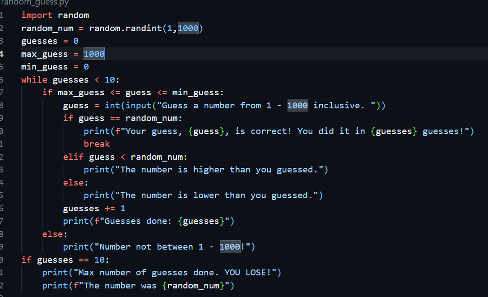

this is my random guess code

### Data Dictionary
| Variables | Properties | Use in project |
| ----------- | ----------- | ------------------|
| random_num | integer | the number the user has to guess
max_guess | integer | the highest number the user has guessed
min_guess | integer | the lowest number the user has guessed
guesses | integer | the number of guesses the user has done